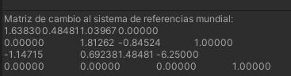

# Seminario: Mundos virtuales. Introducción a la programación de gráficos 3D.

## Autores:
* Diego Herrera Mendoza
* Ginés Cruz Chávez
* Adriano dos Santos Moreira

1. Qué funciones se pueden usar en los scripts de Unity para llevar a cabo traslaciones, rotaciones y escalados.

- LookAt
- Rotate
- RotateAround
- Translate
- SetPositionAndRotation
- SetLocalPositionAndRotation
- transform.scale

2. Como trasladarías la cámara 2 metros en cada uno de los ejes y luego la rotas 30º alrededor del eje Y?. Rota la cámara alrededor del eje Y 30º y desplázala 2 metros en cada uno de los ejes. ¿Obtendrías el mismo resultado en ambos casos?. Justifica el resultado

```cs
transform.Translate(2f, 2f, 2f);
transform.Rotate(0f, 30f, 0f);
```

No se obtendría el mismo resultado, ya que si primero rotamos la cámara, el sistema de referencias cambia, y por lo tanto el desplazamiento sería distinto al primer caso.

3. Sitúa la esfera de radio 1 en el campo de visión de la cámara y configura un volumen de vista que la recorte parcialmente.


5. Sitúa la esfera de radio 1 en el campo de visión de la cámara y configura el volumen de vista para que la deje fuera de la vista.


7. Como puedes aumentar el ángulo de la cámara. Qué efecto tiene disminuir el ángulo de la cámara.


Para aumentar el ángulo de la cámara tendríamos que cambiar el parámetro "Field of View". En caso de disminuirlo, es como hacer zoom a costa de perder visión lateral.

6. Es correcta la siguiente afirmación: Para realizar la proyección al espacio 2D, en el inspector de la cámara, cambiaremos el valor de projection, asignándole el valor de orthographic

Sí, es correcta. La proyección ortográfica no tiene en cuenta la distancia de los objetos a la cámara, por lo que se realizaría en espacio 2D.

7. Especifica las rotaciones que se han indicado en los ejercicios previos con la utilidad quaternion.

```cs
var rotation = Quaternion.Euler(0f, 30f, 0f);
```

8. ¿Como puedes averiguar la matriz de proyección en perspectiva que se ha usado para proyectar la escena al último frame renderizado?.

```cs
Camera.main.previousViewProjectionMatrix;
```

9. ¿Como puedes averiguar la matriz de proyección en perspectiva ortográfica que se ha usado para proyectar la escena al último frame renderizado?.

La propiedad explicada en el ejercicio anterior sirve para cámaras con perspectiva normal u ortográfica, y devuelve la matriz adecuada.

10. ¿Cómo puedes obtener la matriz de transformación entre el sistema de coordenadas local y el mundial?.

```cs
transform.localToWorldMatrix;
```

11. Cómo puedes obtener la matriz para cambiar al sistema de referencia de vista

```cs
transform.worldToLocalMatrix;
```

12. Especifica la matriz de la proyección usado en un instante de la ejecución del ejercicio 1 de la práctica 1.


14. Especifica la matriz de modelo y vista de la escena del ejercicio 1 de la práctica 1.

```cs
Camera.main.worldToCameraMatrix;
```


14. Aplica una rotación en el start de uno de los objetos de la escena y muestra la matriz de cambio al sistema de referencias mundial.



15. ¿Como puedes calcular las coordenadas del sistema de referencia de un objeto con las siguientes propiedades del Transform:?: Position (3, 1, 1), Rotation (45, 0, 45)
